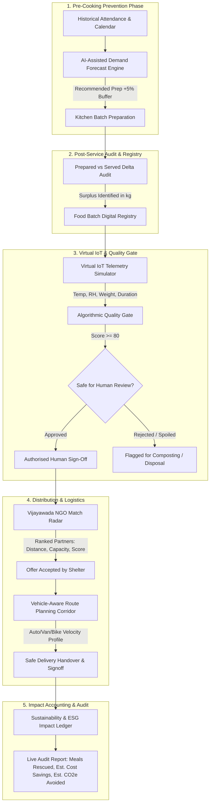

# 🍲 SmartFood Rescue AI
> **Tagline:** *“Predict. Rescue. Redistribute. Measure.”*  
> **Smart India Hackathon Software Edition:** Problem Statement **SIH26234**  
> **Team Name:** Annadata AI  
> **Repository:** `SmartFood-Rescue-AI_SIH_2026`  
> **Demonstration Pilot:** Vijayawada, Andhra Pradesh, India 🇮🇳  

[](https://react.dev/)
[](https://www.typescriptlang.org/)
[](https://vitejs.dev/)
[](https://tailwindcss.com/)
[](https://www.sih.gov.in/)
[](https://firebase.google.com/)
[](https://smartfood-rescue-ai-25f38.web.app)
[](#-virtual-iot-monitoring-simulator)
[](LICENSE)

---

## 🚀 Executive Summary

SmartFood Rescue AI is a software-first decision-support platform for institutional kitchens, cafeterias, hostels, caterers, and food-processing units. It reduces avoidable food waste through a complete operational loop:

1. Forecast food demand before cooking.
2. Register prepared and served food batches.
3. Detect surplus automatically.
4. Simulate storage telemetry and evaluate quality-risk conditions.
5. Require authorised human approval before redistribution.
6. Match eligible surplus with nearby NGO partners.
7. Estimate route feasibility and delivery timing.
8. Measure food waste prevented, meals saved, estimated cost savings, and estimated carbon impact.

> **Prototype disclaimer:** All NGO, sensor, route, and logistics data are simulated for the Vijayawada pilot. The application supports decisions; it does not certify food safety or replace authorised human review.

---

## 📖 Table of Contents
1. [Project Overview & Problem Statement](#-project-overview--problem-statement)
2. [End-to-End System Architecture](#-end-to-end-system-architecture)
3. [Technology Stack & Core Dependencies](#-technology-stack--core-dependencies)
4. [Mathematical Models & Decision Formulas](#-mathematical-models--decision-formulas)
5. [Key Features & Application Pages](#-key-features--application-pages)
6. [Role-Based Access Control](#-role-based-access-control)
7. [Virtual IoT Simulator (Hardware-Free Implementation)](#-virtual-iot-monitoring-simulator)
8. [Canonical Hackathon Demo Scenario (Vijayawada)](#-canonical-hackathon-demo-scenario-vijayawada)
9. [Application Screenshots](#-application-screenshots)
10. [Quick Start & Comprehensive Installation Guide](#-quick-start--comprehensive-installation-guide)
11. [Project Directory Structure](#-project-directory-structure)
12. [Judge / Evaluator Walkthrough Script](#-judge--evaluator-walkthrough-script)
13. [Compliance & Ethical Disclaimers](#-compliance--ethical-disclaimers)
14. [Future Production Roadmap](#-future-production-roadmap)
15. [Team & Attribution](#-team--attribution)

---

## 📌 Project Overview & Problem Statement

### The Problem in Institutional Kitchens
College canteens, university hostels, hospital cafeterias, large caterers, and food processing facilities face acute unpredictability in daily attendance and dining volume:
- Kitchen administrators fear food shortages, consistently cooking **15% to 25% more meals** than consumed.
- Excess cooked food sits in warm ambient temperatures without automated shelf-life tracking.
- Due to a lack of verified logistical networks, wholesome residual meals end up in municipal landfills.
- Decomposing organic food waste in open dumps emits massive volumes of **methane ($\text{CH}_4$)**, a potent greenhouse gas, while universities incur heavy financial losses.

### The Solution: SmartFood Rescue AI
A software-first, closed-loop platform that integrates:
1. **AI-Assisted, Data-Informed Demand Forecasting** to prevent overproduction at the source.
2. **Automated Surplus Detection & Batch Registration** to quantify residual food immediately after service.
3. **Virtual IoT Storage Telemetry** to track temperature, humidity, and storage hours without physical hardware.
4. **Algorithmic Decision-Support Quality Gate** to evaluate risk conditions before human review.
5. **Multi-Criteria NGO Matching Radar** in Vijayawada to pair batches with nearby vetted shelters.
6. **Time-Aware Route Planning with vehicle-specific speed models to estimate delivery feasibility before the configured redistribution deadline.**
7. **Transparent ESG & Sustainability Accounting** measuring meals rescued, estimated cost savings (₹), and estimated $\text{CO}_2\text{e}$ mitigated.

---

## 🏗️ End-to-End System Architecture

SmartFood Rescue AI is engineered as a resilient **4-tier modular web application**. The system cleanly separates client presentation, algorithmic decision engines, simulated IoT telemetry, and browser-local persistent storage. This ensures zero runtime failures, zero latency, and zero dependency on external network services during live hackathon evaluation.

### The 4-Tier Architectural Pattern

```
┌─────────────────────────────────────────────────────────────────────────────┐
│                       1. PRESENTATION & INTERACTION LAYER                   │
│   React 19 (Component Hierarchy) • Tailwind CSS v4 • Lucide React • Recharts│
│   [Landing] [Dashboard] [Forecast] [Batches] [IoT Sim] [Quality] [Matching] │
│   [Route Plan] [ESG Analytics] [Reports] [Settings] [Role Switcher]         │
└──────────────────────────────────────┬──────────────────────────────────────┘
                                       │ State & Event Dispatch
┌──────────────────────────────────────▼──────────────────────────────────────┐
│                    2. ALGORITHMIC & DECISION-SUPPORT LAYER                  │
│       Pure Deterministic TypeScript Mathematical & Operational Engines       │
│   • Demand Forecasting Engine (Historical smoothing + contextual modifiers) │
│   • Quality Assessment Gate (Deduction-based 100-pt safety scoring)         │
│   • NGO Match Radar (Multi-criteria weighted distance, capacity, urgency)   │
│   • Logistics Routing Engine (Vehicle-specific velocity & feasibility model) │
│   • ESG Impact Ledger (Standardized conversion: 4 meals/kg, ₹200/kg, CO2e)  │
└───────────────────▲──────────────────────────────────────┬──────────────────┘
                    │                                      │
┌───────────────────┴──────────────────┐ ┌─────────────────▼──────────────────┐
│  3. VIRTUAL TELEMETRY & SIMULATOR    │ │ 4. CLIENT STATE & CACHE LAYER      │
│  • Hardware-Free Sensor Simulation   │ │ • LocalStorage v2 Key-Value Store  │
│  • Temperature, Humidity & Weight    │ │ • Atomic Seed & Canonical Ingestion│
│  • Safe/Breach Threshold Triggers    │ │ • Zero-Latency Reset Engine        │
│  • Visual Badges & Alert Overrides   │ │ • Cross-Component Reactive Sync    │
└──────────────────────────────────────┘ └────────────────────────────────────┘
```

### End-to-End Operational Lifecycle Workflow



---

## 🛠️ Technology Stack & Core Dependencies

The platform is constructed on modern, type-safe web technologies configured for instant rendering, rapid feedback loops, and production reliability.

| Layer / Role | Technology / Package | Version | Architectural Justification & Responsibility |
|:---|:---|:---|:---|
| **Core Framework** | [React](https://react.dev/) | `^19.2.8` | Component-driven UI architecture leveraging React 19 modern rendering model and client-side reactive hooks (`useState`, `useEffect`, `useCallback`, `useMemo`). |
| **DOM Renderer** | [React DOM](https://react.dev/) | `^19.2.8` | High-performance reconciliation and DOM manipulation engine. |
| **Language** | [TypeScript](https://www.typescriptlang.org/) | `~6.0.2` | Complete static type safety across all domain interfaces (`FoodBatch`, `DemandForecast`, `SensorTelemetry`, `NgoProfile`, `RoutePlan`, `EsgMetrics`), eliminating runtime reference exceptions. |
| **Build Engine & Dev Server** | [Vite](https://vite.dev/) | `^8.3.0` | Next-generation bundler delivering lightning-fast sub-100ms Hot Module Replacement (HMR) and optimized rollup production bundles. |
| **Styling & Design System** | [Tailwind CSS](https://tailwindcss.com/) | `^4.3.3` | Tailwind v4 CSS-first design system engine via `@tailwindcss/vite`, generating zero-runtime utility classes with modern emerald/amber/rose color palettes and glassmorphism. |
| **Vite React Plugin** | [@vitejs/plugin-react](https://github.com/vitejs/vite-plugin-react) | `^6.1.1` | Enables fast React JSX transformation, Fast Refresh, and Babel/SWC optimizations. |
| **Data Visualization** | [Recharts](https://recharts.org/) | `^3.10.1` | Responsive, composable SVG charting for dynamic demand forecasting trends, 24-hour virtual sensor curves, and ESG cumulative impact graphs. |
| **Iconography Suite** | [Lucide React](https://lucide.dev/) | `^1.48.0` | Accessible, unified vector icons across all navigation bars, status badges, sensors, map pins, and action buttons. |
| **CSS Utility Helpers** | [clsx](https://github.com/lukeed/clsx) & [tailwind-merge](https://github.com/dcastil/tailwind-merge) | `^2.1.1` & `^3.7.0` | Conflict-free conditional class concatenation and dynamic Tailwind variant merging. |
| **Micro-Interactions** | [canvas-confetti](https://www.npmjs.com/package/canvas-confetti) | `^1.9.4` | Lightweight celebratory physics animation triggered upon successful food rescue dispatch and receipt completion. |
| **Static Code Quality** | [Oxlint](https://oxc-project.github.io/) | `^1.81.0` | High-performance Rust-based static analyzer enforcing clean code, optimal patterns, and zero lint warnings across the codebase. |
| **Type Definitions** | `@types/node`, `@types/react`, `@types/react-dom`, `@types/canvas-confetti` | Latest | Standardized type declarations for browser and Node.js toolchain interoperability. |
| **Cloud Services & DB** | [Firebase](https://firebase.google.com/) | `^12.19.0` | Google Cloud Firebase suite integrating Cloud Firestore real-time database, Authentication, Cloud Storage (batch verification photos), and Analytics with HMR protection. |
| **Serverless Functions** | [Firebase Functions](https://firebase.google.com/docs/functions) | `^7.0.0` | TypeScript serverless Cloud Functions codebase (`functions/`) for automated scheduled audits, real-time alerts, and backend webhook triggers. |
| **Edge CDN Hosting** | [Firebase Hosting](https://firebase.google.com/docs/hosting) | Global CDN | Production single-page application hosting with instant worldwide edge distribution (`smartfood-rescue-ai-25f38.web.app`). |

### Architectural Design Decisions
1. **Hybrid Dual-Persistence Strategy (Local-First + Cloud Sync):** 
   - **Offline-First Resilience:** In live hackathon pitches, venue Wi-Fi drops can kill cloud-dependent apps. SmartFood Rescue AI runs pure deterministic TypeScript algorithms and reactive state backed by browser `LocalStorage v2`, guaranteeing 100% functionality with zero latency even without internet access.
   - **Cloud Extensibility:** Pre-wired with Google Firebase (`src/services/firebase.ts`, `firestore.rules`, `functions/`) for multi-device sync, Firestore batch streaming, and Cloud Functions backend automation.
2. **Tailwind v4 Native CSS:** Zero-configuration CSS compilation using modern `@import "tailwindcss";` in `src/index.css` provides optimized bundle size, high performance, and rapid UI development.
3. **Hardware-Free Deterministic Simulation:** Physical IoT hardware in live hackathon venues frequently suffers from Wi-Fi drops, battery exhaustion, or calibration drift. Our Virtual IoT Simulator replicates multi-sensor telemetry mathematically while providing judges with interactive threshold controls (Normal, Warning, Danger) to test system resilience in real time.

---

## 📐 Mathematical Models & Decision Formulas

### 1. Demand Forecast Baseline Model

$$\text{Raw Predicted Demand} = \text{Expected Attendance} \times 0.92$$

**Contextual Adjustments:**
- **Campus Event / Holiday:** $+8\%$ modifier
- **Special Feast Menu:** $+5\%$ modifier
- **Historical Smoothing:**
  $$\text{Predicted Demand} = \text{round}\Big(0.90 \times \text{Adjusted Raw} + 0.05 \times \text{PrevDay} + 0.05 \times \text{Avg7Day}\Big)$$

**Recommended Kitchen Preparation:**
$$\text{Recommended Preparation} = \text{round}\big(\text{Predicted Demand} \times 1.05\big)$$
*(Includes a $5\%$ calibrated safety buffer to avert meal deficits while curbing overproduction).*

> **Prototype note:** The current release uses an explainable, configurable forecasting baseline based on expected attendance, event flags, previous-day demand, and seven-day average demand. In production, the same input pipeline can support a trained machine-learning model using institution-specific historical consumption data.

**Canonical Demo Verification:**
- Expected Attendance: **320**
- No holiday / event, no special menu
- Previous Day Demand: **295**
- Seven-Day Average Demand: **295**
- **Result:** Predicted Demand = **295 meals**, Recommended Preparation = **310 meals**.

---

### 2. Quality-Risk Deduction Scoring Engine
Starting at a pristine baseline score of **$100$ points**:

$$\text{Final Score} = 100 - \sum \text{Deductions}$$

| Factor Checked | Violation Condition | Deduction Penalty |
| :--- | :--- | :---: |
| **Storage Temperature** | Temperature exceeds the prototype-configured storage threshold (default: 8°C) | **$-35\text{ pts}$** |
| **Redistribution Deadline** | Redistribution deadline passed (current time $>$ scheduled use-by window) | **$-40\text{ pts}$** |
| **Packaging Integrity** | Packaging damaged: broken seal, damaged container, or lid leakage | **$-25\text{ pts}$** |
| **Sensory Appearance** | Human-entered visual or sensory concern: discoloration, abnormal texture, or staff-reported odor concern | **$-30\text{ pts}$** |
| **Storage Environment** | Improper storage environment: uninsulated vessel or open ambient contamination | **$-20\text{ pts}$** |
| **Telemetry Gateway** | Virtual IoT device/sensor status offline | **$-10\text{ pts}$** |

**Classification Thresholds:**
- **$80 \le \text{Score} \le 100$**: **Safe for Human Review** (Eligible for NGO broadcast with authorised sign-off)
- **$50 \le \text{Score} \le 79$**: **Needs Manual Inspection** (Requires physical kitchen staff inspection)
- **$\text{Score} < 50$**: **Do Not Redistribute** (Flagged unsafe; disposal recommended)

> **Mandatory Disclaimer:** This AI-assisted quality indicator is a decision-support tool only. It does not certify food safety. Final approval for redistribution must be given by authorised kitchen staff or a qualified food-safety officer.

---

### 3. Multi-Criteria NGO Matching Algorithm
Matches eligible batches against active shelters in Vijayawada using a 100-point composite model:

$$\text{NGO Match Score (out of 100)} = S_{\text{dist}} + S_{\text{cap}} + S_{\text{cat}} + S_{\text{avail}}$$

1. **Distance Score ($35\%$ Weight, benchmark 12 km radius in Vijayawada):**
   $$S_{\text{dist}} = \max\left(0, 35 \times \left(1 - \frac{\text{Distance (km)}}{12}\right)\right)$$
2. **Capacity Score ($25\%$ Weight):**
   $$S_{\text{cap}} = 25 \times \min\left(1, \frac{\text{Available NGO Capacity}}{\text{Batch Surplus}}\right)$$
   *(If an NGO has insufficient capacity, the platform flags “Partial Capacity Available” and suggests splitting the batch between two NGOs rather than recommending it as a best match for a full batch).*
3. **Dietary Category Match ($20\%$ Weight):**
   $$S_{\text{cat}} = \begin{cases} 20 & \text{if recipient accepts food category (Cooked / Packaged / Raw)} \\ 0 & \text{if food category not accepted} \end{cases}$$
4. **Availability & Hours ($20\%$ Weight):**
   $$S_{\text{avail}} = \begin{cases} 20 & \text{if Available and within operating hours} \\ 8 & \text{if Busy but still potentially reachable} \\ 0 & \text{if Offline or Closed} \end{cases}$$

**Canonical Demo Verification (Hope Food Bank):**
- Location: Benz Circle, Vijayawada (Distance: $3.2\text{ km}$, Capacity: $25\text{ kg}$, Batch Surplus: $14\text{ kg}$, Category: Cooked Food, Status: Available)
- $S_{\text{dist}} = 35 \times (1 - 3.2 / 12) \approx 25.67$
- $S_{\text{cap}} = 25 \times \min(1, 25 / 14) = 25.00$
- $S_{\text{cat}} = 20.00$
- $S_{\text{avail}} = 20.00$
- Total $= 25.67 + 25 + 20 + 20 \approx 90.67 \rightarrow$ **Display rounded score = 91% match score**.

---

### 4. Time-Aware Route Planning & Safety Index

$$\text{Travel Time (minutes)} = \left(\frac{\text{Distance (km)}}{\text{Vehicle Speed (km/h)}}\right) \times 60 + \text{Handling Buffer (10 mins)}$$

- Default Vehicle: Three-Wheeler Auto ($20\text{ km/h}$)
- Distance: $3.2\text{ km}$
- Travel time: $(3.2 / 20) \times 60 + 10 = 9.6 + 10 = 19.6\text{ minutes} \approx \mathbf{20\text{ minutes}}$

> **Safe Wording Principle:** *Time-Aware Route Planning estimates delivery feasibility before the configured redistribution deadline.*

**Route Safety Labels:**
- **Safe:** expected arrival is comfortably before deadline.
- **At Risk:** expected arrival is close to deadline.
- **Deadline Missed:** expected arrival occurs after deadline.

---

### 5. Sustainability & ESG Impact Metrics

- **Meals Rescued:**
  $$\text{Meals Saved} = \frac{\text{Food Redistributed (kg)}}{0.25\text{ kg/meal}}$$
- **Estimated Economic Savings (₹):**
  $$\text{Estimated Cost Saved (₹)} = \text{Waste Avoided (kg)} \times ₹200/\text{kg}$$
- **Estimated Carbon Emissions Avoided:**
  $$\text{Estimated Carbon Avoided} = \text{Waste Avoided (kg)} \times 2.5\text{ kg CO}_2\text{e per kg}$$
- **Waste Prevention Rate:**
  $$\text{Prevention Rate (\%)} = \left(\frac{\text{Baseline Waste} - \text{Current Waste}}{\text{Baseline Waste}}\right) \times 100$$

*(Cost and carbon values are labelled as “Estimated” / “Prototype estimate” because they represent configurable institutional benchmarks, not verified institutional accounting records).*

**Canonical Completed-Delivery Scenario:**
- Food Redistributed: **14 kg** (Waste Avoided: 14 kg)
- Meals Saved: **56**
- Estimated Cost Saved: **₹2,800**
- Estimated Carbon Avoided: **35.0 kg CO₂e**

---

## 💻 Key Features & Application Pages

| Page / Module | Purpose & Core Capabilities |
| :--- | :--- |
| **1. Landing Page** | Public front page with problem workflow, 6-pillar solution, impact cards, and SIH26234 problem context. |
| **2. Role Selection** | Quick entry point to login as **Demo User** under 4 operational roles: *Kitchen Staff*, *NGO Partner*, *Delivery Partner*, *Administrator*. |
| **3. Operational Dashboard** | 8 primary KPI cards, 4 Recharts graphs (7-day waste trend, prep vs served, batch status pie, weekly volume), recent alerts, pending NGO requests, delivery timeline. |
| **4. Demand Forecast** | Interactive calculator with attendance slider, meal category pickers, baseline rule checkboxes, risk badge, recommendation message, history table, and CSV export. |
| **5. Food Batches & Surplus** | Batch registration modal, automatic surplus calculation, deadline countdown, status badges, and quick links to quality checks and donation dispatch. |
| **6. Virtual IoT Simulator** | Software emulator with real-time temperature, humidity, weight, duration, 5 manual sliders, and 6 instant preset scenarios. |
| **7. Quality Check** | Circular score gauge (0–100), factor penalty breakdown, reviewer notes, human sign-off authorization gate, and mandatory food safety disclaimer. |
| **8. NGO Matching** | Ranked radar of 4 Vijayawada partners (Hope Food Bank, Seva Shelter, Helping Hands, Community Kitchen) with simulation of NGO accept/reject and fallback. |
| **9. Route Planning** | Map corridor interface, vehicle selector (Auto/Bike/Van), travel time calculator, 6-step dispatch timeline, and delivery photo proof. |
| **10. Sustainability Analytics** | 10 impact KPIs, 8 Recharts trend charts, UN SDG 12.3 alignment, and 1-click ESG CSV download. |
| **11. Audit Reports** | Executive printable compliance certificate with print stylesheet (Save as PDF) and itemized batch logs. |
| **12. Platform Settings** | Configurable canteen profile, thresholds, cost per kg, carbon factors, and reset demo data button. |

---

## 👥 Role-Based Access Control

The application provides customizable interfaces tailored to each stakeholder:

1. **Kitchen Staff:**
   - Records food batches, runs forecasts, monitors alerts, and submits batches for review.
   - Can record an authorised approval decision according to institutional policy.
   - *(Kitchen Staff does not independently provide legal food-safety certification; all evaluations remain operational decision support).*
2. **NGO Partner:**
   - Focuses on recipient surplus alerts in Vijayawada, incoming food offers, and accepting/declining batches.
3. **Delivery Partner:**
   - Specialized in transit route planning, vehicle assignment, step-by-step dispatch tracking, and delivery proof uploads.
4. **Administrator:**
   - Supervisory access to configure policy thresholds, review compliance reports, and oversee the prototype approval workflow.

---

## 📡 Virtual IoT Monitoring Simulator

> **Important Hackathon Constraint:** This project is **100% software-based** and requires no physical ESP32, Raspberry Pi, load cells, or physical hardware sensors.

The simulator provides:
- **Interactive Telemetry Sliders:** Real-time adjustment of Temperature (0–50°C), Relative Humidity (0–100%), Container Weight (0–50 kg), and Storage Duration (0–24 hrs).
- **6 One-Click Demonstration Scenarios:**
  1. **Simulate Normal Storage:** 5.0°C, 55% RH, Insulated Vessel, Online $\rightarrow$ *Simulated reading within prototype-configured 8°C threshold; human approval remains mandatory*.
  2. **Simulate High Temperature:** 28.0°C thermal abuse $\rightarrow$ *Warning: Temperature exceeds prototype-configured storage threshold*.
  3. **Simulate Expired Food:** Storage $> 8$ hours, deadline passed $\rightarrow$ *Critical Alert & Redistribution Blocked*.
  4. **Simulate Weight Reduction:** Dynamic delta in load scale readings.
  5. **Simulate Sensor Offline:** Emulates gateway disconnection $\rightarrow$ *Warning Penalty Applied*.
  6. **Reset Simulation:** Returns to default canonical readings.
- **Streaming Telemetry Table:** Timestamped readings log with status flags.

---

## 🎯 Canonical Hackathon Demo Scenario (Vijayawada)

| Parameter | Demonstration Value | Hackathon Context |
| :--- | :--- | :--- |
| **Facility** | Smart College Canteen | Near Kanaka Durga Varadhi, MG Road, Vijayawada |
| **Attendance Input** | **320 students & staff** | Thursday hostel and day-scholar lunch service |
| **Demand Forecast** | **295 meals** | $320 \times 0.92 = 294.4 \approx 295$ baseline prediction |
| **Kitchen Preparation** | **310 meals** | $295 \times 1.05 = 309.75 \approx 310$ (+5% safety buffer) |
| **Actual Meals Served** | **292 meals** | High forecast accuracy ($98.9\%$) |
| **Residual Surplus** | **18 meals (14.0 kg)** | Identified automatically upon service wrap-up |
| **Virtual IoT Status** | **5.2°C, 55% RH, Online** | Simulated reading within the prototype-configured 8°C threshold; human approval remains mandatory |
| **Quality Score** | **100 / 100** | Status: *Safe for Human Review* |
| **Best Match NGO** | **Hope Food Bank** | Benz Circle, Vijayawada (3.2 km, 25 kg cap, 91% match score) |
| **Transit Corridor** | **Three-Wheeler Auto** | 20 mins total travel & container handling time |
| **Delivery Status** | **Delivered ✓** | Completed with photo receipt confirmation |
| **Rescued Social Impact** | **56 meals saved** | $14.0\text{ kg} \div 0.25\text{ kg/meal}$ |
| **Estimated Financial Savings** | **₹2,800** | $14.0\text{ kg} \times ₹200/\text{kg}$ (Prototype estimate) |
| **Estimated Carbon Avoidance** | **35.0 kg CO₂e** | $14.0\text{ kg} \times 2.5\text{ kg CO}_2\text{e/kg}$ (Prototype estimate) |

---

## 📸 Application Screenshots

> Add application screenshots after running or deploying the project.

| Landing Page | Dashboard |
|---|---|
|  |  |

| Demand Forecast | NGO Matching |
|---|---|
|  |  |

| Quality Check | Sustainability Analytics |
|---|---|
|  |  |

---

## ⚡ Quick Start & Comprehensive Installation Guide

### System Prerequisites
Ensure your local development environment meets the following specifications before installation:
- **Node.js**: `v18.20.0+`, `v20.x`, or `v22.x` (LTS versions strongly recommended). Check via `node -v`.
- **Package Manager**: `npm` (v9+ or v10+ included with Node.js), `pnpm` (v8+), or `yarn` (v1.22+). Check via `npm -v`.
- **Version Control**: `git` (v2.30+). Check via `git --version`.
- **Web Browser**: Any modern evergreen browser (Google Chrome, Microsoft Edge, Mozilla Firefox, or Safari) with JavaScript and LocalStorage enabled.

---

### Step-by-Step Installation

#### 1. Clone the Repository
Clone the project from GitHub to your local machine:
```bash
git clone https://github.com/mahammedsathyala/SmartFood-Rescue-AI_SIH_2026.git
cd SmartFood-Rescue-AI_SIH_2026
```

#### 2. Install Dependencies
Install all required runtime and development packages:
```bash
# Using standard npm (recommended)
npm install

# Alternatively using pnpm or yarn
# pnpm install
# yarn install
```

#### 3. Start the Local Development Server
Launch Vite's development server with Hot Module Replacement (HMR):
```bash
npm run dev
```
Once the dev server compiles, open your web browser and navigate to:
```text
http://localhost:5173/
```
The application will automatically load with the canonical **Vijayawada Pilot** seed dataset pre-populated in your browser's `LocalStorage`.

#### 4. Verify Static Code Quality & Linter
Run the static code analysis suite to verify code health:
```bash
npm run lint
```
*Expected output: Clean exit with zero errors or warnings.*

#### 5. Compile for Production & Typecheck
Execute a full TypeScript build and bundle compilation:
```bash
npm run build
```
This runs `tsc -b` to validate strict type definitions followed by Vite compiling production-optimized HTML, CSS, and JS bundles into the `/dist` directory.

#### 6. Preview the Production Bundle Locally
Test the compiled production bundle under realistic serving conditions:
```bash
npm run preview
```
Vite will serve the `/dist` folder locally at `http://localhost:4173/`.

---

### NPM Scripts Reference Table

| Script Command | Underlying Execution | Description & Purpose |
|:---|:---|:---|
| `npm run dev` | `vite` | Starts the fast local development server on port 5173 with instant Hot Module Replacement. |
| `npm run build` | `tsc -b && vite build` | Performs strict whole-project TypeScript typechecking and compiles minified production assets into `/dist`. |
| `npm run lint` | `oxlint` | Runs the high-performance Oxlint linter across all `.ts` and `.tsx` files in the repository. |
| `npm run preview` | `vite preview` | Boots a lightweight local HTTP server to preview and test the built production distribution. |
| `npx firebase deploy --only hosting` | `firebase deploy` | Deploys the compiled `/dist` single-page application to Firebase Hosting edge CDN. |
| `npx firebase deploy` | `firebase deploy` | Deploys all services (Hosting, Firestore rules, and Cloud Functions) simultaneously. |
| `npm --prefix functions run build` | `tsc` | Compiles serverless TypeScript Cloud Functions in `/functions`. |

---

### Environment & Cloud Configuration

SmartFood Rescue AI is engineered for both **plug-and-play zero-config offline usage** and **cloud-ready production deployment**:
- **Offline / Zero-Config by Default:** All core algorithms, simulations, route planning, and ESG reporting operate out-of-the-box without requiring external API keys. Data persists seamlessly in browser `LocalStorage v2`.
- **Firebase Cloud Services (.env):** When connecting to live Firebase Cloud Firestore, Authentication, or Storage, credentials are automatically loaded from `.env` (with a `.env.example` template provided):
  ```bash
  VITE_FIREBASE_API_KEY=AIzaSyC7VchI...
  VITE_FIREBASE_AUTH_DOMAIN=smartfood-rescue-ai.firebaseapp.com
  VITE_FIREBASE_PROJECT_ID=smartfood-rescue-ai
  VITE_FIREBASE_STORAGE_BUCKET=smartfood-rescue-ai.firebasestorage.app
  VITE_FIREBASE_MESSAGING_SENDER_ID=86396956859
  VITE_FIREBASE_APP_ID=1:86396956859:web:daa396f63a353ce132b99e
  VITE_FIREBASE_MEASUREMENT_ID=G-WBWCX7W49D
  ```
- **Live Deployment:** The production build is hosted live at [https://smartfood-rescue-ai-25f38.web.app](https://smartfood-rescue-ai-25f38.web.app).

---

### 🗺️ Maps Integration

SmartFood Rescue AI implements a secure, resilient dual-mode route visualization system:

- **Google Maps Demo Key (`VITE_GOOGLE_MAPS_DEMO_KEY`):**
  - Optional client-side environment variable (`.env.local`).
  - Used strictly in the React frontend to render an interactive Google Map with origin (Smart College Canteen) and destination (Hope Food Bank, Benz Circle) markers and route polylines for testing and prototyping.
  - Displays: `“Google Maps Demo Integration — testing/prototyping only.”`
- **Route Simulation Mode (Zero-Crash Fallback):**
  - If no demo key is configured, or if the key is missing, invalid, expired, or unavailable, the application operates in **Route Simulation Mode**.
  - Renders a clean animated transit corridor simulation without crashing or depending on external APIs.
  - Displays: `“Map Simulation Mode — Google Maps demo key is unavailable.”`
- **Secure Server Routes Key (`GOOGLE_MAPS_SERVER_ROUTES_KEY`):**
  - The production Google Routes Server Key is **never exposed to the browser, Vite client code, or public bundles**.
  - Stored only in backend environments (`backend/.env.example`).
  - Reserved for future secure backend execution (FastAPI/Node.js via `POST /api/routes/estimate`) where the backend queries the Google Routes API securely and streams sanitized metrics to the client.

---

### Troubleshooting & FAQ

<details>
<summary><strong>Q1: Port 5173 is already in use by another application.</strong></summary>

You can specify an alternative port directly via the command line:
```bash
npm run dev -- --port 3000 --open
```
Vite will start the server on port 3000 and automatically open your default browser.
</details>

<details>
<summary><strong>Q2: Stale data or unexpected state in browser session.</strong></summary>

If you previously tested another build, navigate to the **Settings** page within the app and click **"Reset Demo Data"**, or run the following in your browser's Developer Tools Console (`F12`):
```javascript
localStorage.clear();
location.reload();
```
The app will immediately re-seed all canonical Vijayawada baseline records (`sfr_batches_v2`, `sfr_forecasts_v2`, etc.).
</details>

<details>
<summary><strong>Q3: Windows PowerShell execution policy error running npm.</strong></summary>

If Windows PowerShell displays `File ... cannot be loaded because running scripts is disabled on this system`, run PowerShell as Administrator and execute:
```powershell
Set-ExecutionPolicy -Scope Process -ExecutionPolicy Bypass
```
Then re-run `npm run dev`.
</details>

<details>
<summary><strong>Q4: Node.js version incompatibility.</strong></summary>

If you see errors regarding unsupported syntax or modern JavaScript features, verify your active Node.js version with `node -v`. If you are using `nvm` (Node Version Manager), switch to an active LTS release:
```bash
nvm use 20
npm install
npm run dev
```
</details>

---

## 📂 Project Directory Structure

```
SmartFood-Rescue-AI_SIH_2026/
├── LICENSE                      # MIT License (Team Annadata AI)
├── README.md                    # Comprehensive project documentation
├── package.json                 # Project dependencies & scripts (React 19, Vite 8, TS 6)
├── tsconfig.json                # Root TypeScript configuration
├── tsconfig.app.json            # Application TypeScript settings
├── vite.config.ts               # Vite configuration with React & Tailwind plugins
├── .env.example                 # Template for Firebase credentials & environment keys
├── .firebaserc                  # Firebase project routing (smartfood-rescue-ai)
├── firebase.json                # Firebase Hosting (dist/), Firestore & Functions routing
├── firestore.rules              # Cloud Firestore security rules
├── firestore.indexes.json       # Cloud Firestore query index definitions
├── backend/                     # Future-ready secure backend architecture
│   ├── .env.example             # Secret GOOGLE_MAPS_SERVER_ROUTES_KEY template
│   └── README.md                # Server Routes API & POST /api/routes/estimate docs
├── docs/
│   └── screenshots/             # Visual UI walkthrough artifacts
│       └── .gitkeep
├── functions/                   # Serverless Firebase Cloud Functions codebase
│   ├── src/index.ts             # Cloud Functions triggers & background worker
│   ├── package.json             # Functions dependencies (firebase-admin, functions v7)
│   └── tsconfig.json            # TypeScript build configuration for functions
├── src/
│   ├── main.tsx                 # React DOM bootstrapping
│   ├── App.tsx                  # Master application shell & state coordinator
│   ├── index.css                # Tailwind CSS v4 imports & custom styles
│   ├── types/
│   │   └── index.ts             # Domain models (Batch, Forecast, IoT, NGO, Route, ESG)
│   ├── services/
│   │   ├── firebase.ts          # Firebase SDK client initialization (Auth, DB, Storage)
│   │   ├── mockData.ts          # Seed data for Vijayawada canonical scenario
│   │   └── storage.ts           # LocalStorage service, math formulas & algorithms
│   ├── components/
│   │   ├── Navbar.tsx           # Top header with role switcher, notifications, date
│   │   ├── Sidebar.tsx          # Collapsible/mobile-responsive navigation sidebar
│   │   ├── GoogleRouteMap.tsx   # Dual-mode Google Maps & Corridor Simulation component
│   │   ├── DisclaimerBanner.tsx # Software simulation & food safety disclaimers
│   │   ├── ConfirmationModal.tsx# Reusable modal for alerts and data resets
│   │   └── Toast.tsx            # Animated notification alert container
│   └── pages/
│       ├── LandingPage.tsx          # Public presentation & problem-solution page
│       ├── RoleSelectionPage.tsx    # 4-role login & workspace selector
│       ├── DashboardPage.tsx        # 8 KPI cards, 4 Recharts charts, recent alerts
│       ├── DemandForecastPage.tsx   # Pre-cooking demand predictor with CSV export
│       ├── FoodBatchesPage.tsx      # Batch tracking, surplus calculation & status flows
│       ├── IoTSimulatorPage.tsx     # Virtual IoT emulator with sliders & 6 presets
│       ├── QualityCheckPage.tsx     # Circular score gauge & deduction rule breakdown
│       ├── NgoMatchingPage.tsx      # Multi-criteria Vijayawada partner matching radar
│       ├── RoutePlanningPage.tsx    # Transit corridor map, vehicle matrix & 6-step state
│       ├── SustainabilityPage.tsx   # ESG metrics, 10 KPIs, 8 charts & CSV export
│       ├── ReportsPage.tsx          # Executive printable compliance certificate
│       └── SettingsPage.tsx         # Platform parameter tuning & defaults reset
```

---

## 🎬 Judge / Evaluator Walkthrough Script

Follow this 5-minute flow to demonstrate the entire ecosystem during evaluation:

1. **Landing Page:**
   - Point out the tagline: *“Predict. Rescue. Redistribute. Measure.”*
   - Review the 5-step problem workflow and 6 solution pillars.
   - Click **“Get Started (Choose Role)”**.
2. **Role Selection Page:**
   - Show the 4 available roles. Click **“Continue as Kitchen Staff”**.
3. **Operational Dashboard:**
   - Highlight the **8 KPI Cards** matching the canonical scenario: 295 predicted meals, 310 prepared, 14 kg surplus, 56 meals saved, estimated ₹2,800 saved, estimated 35 kg $\text{CO}_2\text{e}$ avoided.
   - Point out the 4 Recharts charts (7-day waste drop, prep vs served).
4. **Demand Forecast:**
   - In the sidebar, click **Demand Forecast**.
   - Note the transparent engineering prototype banner explaining the baseline model and production ML pathway.
   - Click **“Load Demo Scenario”** (Expected attendance 320, Previous 295, 7-day Avg 295 $\rightarrow$ Predicted 295 meals $\rightarrow$ Recommended prep 310 meals).
   - Show the history table and the 1-click **Export CSV** button.
5. **Virtual IoT Simulator:**
   - In the sidebar, click **Virtual IoT Simulator**.
   - Note the visible software simulation notice banner.
   - Click **“Simulate High Temperature (28°C)”** to see the system turn into an amber/red warning state.
   - Click **“Simulate Normal Storage”** to observe the system recover to optimal storage (5°C) within threshold.
6. **Quality Check & Decision Support:**
   - In the sidebar, click **Quality Check**.
   - Observe the circular gauge showing **100/100** (*Safe for Human Review*) for the canonical normal storage conditions.
   - Review the rule breakdown deductions and click **“Approve for Donation”** with authorised role verification.
7. **NGO Matching Radar:**
   - In the sidebar, click **NGO Matching**.
   - Point out **Hope Food Bank** ranked #1 (Benz Circle, 3.2 km, 25 kg capacity, **91% match score**).
   - Note that if an NGO has insufficient capacity, the system displays "Partial Capacity Available" and suggests splitting the batch.
   - Click **“Simulate NGO Accept”** or test **“Simulate NGO Reject”** to show instant AI fallback to the next best partner (*Seva Shelter Home*).
8. **Route Planning & Delivery:**
   - In the sidebar, click **Route Planning**.
   - View the simulated transit corridor between College Canteen and Hope Food Bank (3.2 km, 20 minutes total via Auto).
   - Toggle vehicle type between *Auto*, *Bike*, and *Van* to see travel time recalculations.
   - Walk through the 6-step timeline and click **“6. Mark Delivered ✓”** to trigger delivery completion confetti.
9. **Sustainability Analytics & Reports:**
   - In the sidebar, view **Sustainability Analytics** to see dynamically calculated ESG figures (56 meals saved, estimated ₹2,800 saved, estimated 35 kg $\text{CO}_2\text{e}$ avoided).
   - Click **Reports** and then **“Print / Save as PDF”** to demonstrate institutional certification generation.

---

## ⚖️ Compliance & Ethical Disclaimers

1. **Software-Only Prototype:**  
   This prototype uses simulated virtual IoT data. In production deployment, the platform connects to physical temperature probes, load cells, smart cold-storage units, and existing kitchen management APIs.
2. **Food Safety & Ethical Redistribution Notice:**  
   The AI quality indicator is an operational decision-support tool only. It does not certify legal food safety under regulatory statutes. Formal redistribution sign-offs must be approved by authorised kitchen staff or certified food-safety officers.
3. **Data Privacy & NGO Contacts:**  
   All contact names, addresses, and phone numbers shown are mock demonstration data for the Vijayawada pilot scenario. No live financial payments or personal beneficiary identities are collected.

---

## 🔮 Future Production Roadmap

- [ ] **Physical Hardware Connectors:** Plug-and-play firmware drivers for ESP32 and LoRaWAN long-range temperature sensors.
- [ ] **Computer Vision Spoilage Detection:** Edge AI image classification for visual surface discoloration and mold detection using kitchen smartphone cameras.
- [ ] **Government FSSAI & Food Bank API Integration:** Direct digital compliance filings with national food-safety and redistribution authorities.
- [ ] **Multi-Facility Aggregator:** Centralized dashboard for city-wide university clusters and district-level food banks across Andhra Pradesh.

---

## 👨‍💻 Team & Attribution

- **Team Name:** Annadata AI
- **Project:** SmartFood Rescue AI
- **Smart India Hackathon Problem Statement:** SIH26234
- **Lead Developer:** [Mahammed Sathyala](https://github.com/mahammedsathyala)
- **Repository:** [https://github.com/mahammedsathyala/SmartFood-Rescue-AI_SIH_2026](https://github.com/mahammedsathyala/SmartFood-Rescue-AI_SIH_2026)

---
*Built with ❤️ for a Zero-Waste, Sustainable India.*
