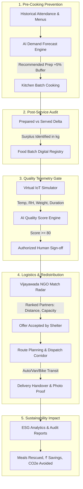

# 🍲 SmartFood Rescue AI
> **Tagline:** *“Predict. Rescue. Redistribute. Measure.”*  
> **Smart India Hackathon Software Edition:** Problem Statement **SIH26234**  
> **Theme:** *AI-Powered Smart Food Waste Reduction and Sustainable Redistribution Ecosystem for Institutional Kitchens and Food Processing Units*  
> **Demonstration Pilot:** Vijayawada, Andhra Pradesh, India 🇮🇳  

[](https://react.dev/)
[](https://www.typescriptlang.org/)
[](https://vitejs.dev/)
[](https://tailwindcss.com/)
[](https://www.sih.gov.in/)
[](#-virtual-iot-monitoring-simulator)
[](https://opensource.org/licenses/MIT)

---

## 📖 Table of Contents
1. [Project Overview & Problem Statement](#-project-overview--problem-statement)
2. [End-to-End System Architecture](#-end-to-end-system-architecture)
3. [Mathematical Models & Decision Formulas](#-mathematical-models--decision-formulas)
4. [Key Features & Application Pages](#-key-features--application-pages)
5. [Role-Based Access Control](#-role-based-access-control)
6. [Virtual IoT Simulator (Hardware-Free Implementation)](#-virtual-iot-monitoring-simulator)
7. [Canonical Hackathon Demo Scenario (Vijayawada)](#-canonical-hackathon-demo-scenario-vijayawada)
8. [Quick Start & Local Setup](#-quick-start--local-setup)
9. [Project Directory Structure](#-project-directory-structure)
10. [Judge / Evaluator Walkthrough Script](#-judge--evaluator-walkthrough-script)
11. [Compliance & Ethical Disclaimers](#-compliance--ethical-disclaimers)
12. [Future Production Roadmap](#-future-production-roadmap)

---

## 📌 Project Overview & Problem Statement

### The Problem in Institutional Kitchens
College canteens, university hostels, hospital cafeterias, large caterers, and food processing facilities face acute unpredictability in daily attendance and dining volume. 
- Kitchen administrators fear food shortages, consistently cooking **15% to 25% more meals** than consumed.
- Excess cooked food sits in warm ambient temperatures without automated shelf-life tracking.
- Due to a lack of verified logistical networks, wholesome residual meals end up in municipal landfills.
- Decomposing organic food waste in open dumps emits massive volumes of **methane ($\text{CH}_4$)**, a potent greenhouse gas, while universities incur heavy financial losses.

### The Solution: SmartFood Rescue AI
A software-first, closed-loop platform that integrates:
1. **Pre-Cooking AI Demand Forecasting** to prevent overproduction at the source.
2. **Automated Surplus Detection & Batch Registration** to quantify residual food immediately after service.
3. **Virtual IoT Cold-Chain Telemetry** to track temperature, humidity, and storage hours without physical hardware.
4. **Algorithmic Decision-Support Quality Gate** to screen safety before human review.
5. **Multi-Criteria NGO Matching Radar** in Vijayawada to pair batches with nearby vetted shelters.
6. **Time-Safe Route Dispatch** with vehicle-specific speed models to guarantee arrival before degradation.
7. **Transparent ESG & Sustainability Accounting** measuring meals rescued, money saved (₹), and $\text{CO}_2\text{e}$ mitigated.

---

## 🏗️ End-to-End System Architecture



---

## 📐 Mathematical Models & Decision Formulas

### 1. Pre-Cooking Demand Forecast Model
$$\text{Raw Predicted Demand} = \text{Expected Attendance} \times 0.92$$

**Contextual Adjustments:**
- **Campus Event / Holiday:** $+8\%$ modifier
- **Special Feast Menu:** $+5\%$ popularity modifier
- **Historical Smoothing:**
  $$\text{Predicted Demand} = \text{round}\Big(0.90 \times \text{Raw} + 0.05 \times \text{PrevDay} + 0.05 \times \text{Avg7Day}\Big)$$

**Recommended Kitchen Preparation:**
$$\text{Recommended Prep} = \text{round}\big(\text{Predicted Demand} \times 1.05\big)$$
*(Includes a $5\%$ calibrated safety buffer to avert meal deficits while curbing overproduction).*

---

### 2. Quality-Risk Deduction Scoring Engine
Starting at a pristine baseline score of **$100$ points**:

$$\text{Final Score} = 100 - \sum \text{Deductions}$$

| Factor Checked | Violation Condition | Deduction Penalty |
| :--- | :--- | :---: |
| **Storage Temperature** | Sensor temperature $> 8.0^\circ\text{C}$ (Cold Chain Broken) | **$-35\text{ pts}$** |
| **Redistribution Deadline** | Current time $>$ Scheduled Use-By Window | **$-40\text{ pts}$** |
| **Packaging Integrity** | Broken seal, damaged container, or lid leakage | **$-25\text{ pts}$** |
| **Sensory Appearance** | Visual discoloration, unnatural texture, sour odor | **$-30\text{ pts}$** |
| **Storage Environment** | Ambient exposure, uninsulated, open contamination | **$-20\text{ pts}$** |
| **Telemetry Gateway** | Virtual IoT communication offline | **$-10\text{ pts}$** |

**Classification Thresholds:**
- **$80 \le \text{Score} \le 100$**: **Safe for Human Review** (Eligible for NGO broadcast)
- **$50 \le \text{Score} \le 79$**: **Needs Manual Inspection** (Requires physical chef inspection)
- **$\text{Score} < 50$**: **Do Not Redistribute** (Flagged unsafe; disposal recommended)

---

### 3. Multi-Criteria NGO Matching Algorithm
Matches eligible batches against active shelters in Vijayawada:

$$\text{Match Score (out of 100)} = S_{\text{dist}} + S_{\text{cap}} + S_{\text{cat}} + S_{\text{avail}}$$

1. **Distance Score ($35\%$ Weight):**
   $$S_{\text{dist}} = \max\left(0, 35 \times \left(1 - \frac{\text{Distance (km)}}{12}\right)\right)$$
2. **Capacity Score ($25\%$ Weight):**
   $$S_{\text{cap}} = \begin{cases} 25 & \text{if NGO Capacity} \ge \text{Batch Surplus} \\ 20 \times \left(\frac{\text{Capacity}}{\text{Surplus}}\right) & \text{otherwise} \end{cases}$$
3. **Dietary Category Match ($20\%$ Weight):**
   $$S_{\text{cat}} = 20 \quad (\text{if recipient accepts Cooked Food / Raw Material})$$
4. **Availability & Hours ($20\%$ Weight):**
   $$S_{\text{avail}} = \begin{cases} 20 & \text{if Available / Open} \\ 8 & \text{if Busy Processing} \\ 0 & \text{if Closed} \end{cases}$$

---

### 4. Route Travel Time & Safety Index
$$\text{Travel Time (minutes)} = \left(\frac{\text{Distance (km)}}{\text{Vehicle Speed (km/h)}}\right) \times 60 + \text{Handling Buffer (10 mins)}$$

- Default Vehicle: Three-Wheeler Auto ($20\text{ km/h}$)
- Estimated arrival is compared against the batch redistribution use-by deadline to mark the corridor as **Safe**, **At Risk**, or **Deadline Missed**.

---

### 5. Sustainability & ESG Impact Metrics
- **Meals Rescued:**
  $$\text{Meals Saved} = \frac{\text{Food Redistributed (kg)}}{0.25\text{ kg/meal}}$$
- **Economic Savings (₹):**
  $$\text{Cost Saved (₹)} = \text{Waste Avoided (kg)} \times ₹200/\text{kg}$$
- **Carbon Emissions Avoided:**
  $$\text{Carbon Avoided} = \text{Waste Avoided (kg)} \times 2.5\text{ kg CO}_2\text{e per kg}$$
- **Waste Prevention Rate:**
  $$\text{Prevention Rate (\%)} = \left(\frac{\text{Baseline Waste} - \text{Current Waste}}{\text{Baseline Waste}}\right) \times 100$$

---

## 💻 Key Features & Application Pages

| Page / Module | Purpose & Core Capabilities |
| :--- | :--- |
| **1. Landing Page** | Public front page with problem workflow, 6-pillar solution, impact cards, and SIH26234 problem context. |
| **2. Role Selection** | Quick entry point to login as **Demo User** under 4 operational roles: *Kitchen Staff*, *NGO Partner*, *Delivery Partner*, *Administrator*. |
| **3. Operational Dashboard** | 8 primary KPI cards, 4 Recharts graphs (7-day waste trend, prep vs served, batch status pie, weekly volume), recent alerts, pending NGO requests, delivery timeline. |
| **4. AI Demand Forecast** | Interactive calculator with attendance slider, meal category pickers, rule checkboxes, risk badge, recommendation message, history table, and CSV export. |
| **5. Food Batches & Surplus** | Batch registration modal, automatic surplus calculation, deadline countdown, status badges, and quick links to quality checks and donation dispatch. |
| **6. Virtual IoT Simulator** | Software emulator with real-time temperature, humidity, weight, duration, 5 manual sliders, and 6 instant preset scenarios. |
| **7. Quality Check** | Circular score gauge (0–100), factor penalty breakdown, reviewer notes, human sign-off authorization gate, and mandatory food safety disclaimer. |
| **8. NGO Matching** | Ranked radar of 4 Vijayawada partners (Hope Food Bank, Seva Shelter, Helping Hands, Community Kitchen) with simulation of NGO accept/reject and fallback. |
| **9. Route Planning** | Map corridor interface, vehicle selector (Auto/Bike/Van), travel time calculator, 6-step dispatch timeline, and delivery photo proof. |
| **10. Sustainability Analytics** | 10 impact KPIs, 8 Recharts trend charts, UN SDG 12.3 alignment, and 1-click ESG CSV download. |
| **11. Audit Reports** | Executive printable compliance certificate with print stylesheet (Save as PDF) and itemized batch logs. |
| **12. Platform Settings** | Configurable canteen profile, thresholds, cost per kg, carbon factors, and reset demo data button. |

---

## 👥 Role-Based Access Control

The application provides customizable interfaces tailored to each stakeholder:

1. **Kitchen Staff:**
   - Full access to record food batches, run demand forecasts, and view sensor alerts.
   - Authorized to grant formal food safety redistribution approval.
2. **NGO Partner:**
   - Focuses on recipient surplus alerts in Vijayawada, incoming food offers, and accepting/declining batches.
3. **Delivery Partner:**
   - Specialized in transit route planning, vehicle assignment, step-by-step dispatch tracking, and delivery proof uploads.
4. **Administrator:**
   - Full supervisory access across all modules, platform settings, rate adjustments, and executive audit reports.

---

## 📡 Virtual IoT Monitoring Simulator

> **Important Hackathon Constraint:** This project is **100% software-based** and requires no physical ESP32, Raspberry Pi, load cells, or hardware sensors.

The simulator provides:
- **Interactive Telemetry Sliders:** Real-time adjustment of Temperature (0–50°C), Relative Humidity (0–100%), Container Weight (0–50 kg), and Storage Duration (0–24 hrs).
- **6 One-Click Demonstration Scenarios:**
  1. **Simulate Normal Storage:** 5.0°C, 55% RH, Insulated Vessel, Online $\rightarrow$ *Green Optimal Status*.
  2. **Simulate High Temperature:** 28.0°C thermal abuse $\rightarrow$ *Red Warning Triggered*.
  3. **Simulate Expired Food:** Storage $> 8$ hours, deadline passed $\rightarrow$ *Red Alert & Redistribution Blocked*.
  4. **Simulate Weight Reduction:** Dynamic delta in load scale readings.
  5. **Simulate Sensor Offline:** Emulates gateway disconnection $\rightarrow$ *Warning Penalty Applied*.
  6. **Reset Simulation:** Returns to default canonical readings.
- **Streaming Telemetry Table:** Timestamped readings log with status flags.

---

## 🎯 Canonical Hackathon Demo Scenario (Vijayawada)

| Parameter | Demonstration Value | Hackathon Context |
| :--- | :--- | :--- |
| **Facility** | Smart College Canteen | Near Kanaka Durga Varadhi, MG Road, Vijayawada |
| **Attendance Input** | **320 students & staff** | Thursday hostel and day-scholar lunch service |
| **AI Demand Forecast** | **295 meals** | $320 \times 0.92 = 294.4 \approx 295$ |
| **Kitchen Preparation** | **310 meals** | $295 \times 1.05 = 309.75 \approx 310$ (+5% safety buffer) |
| **Actual Meals Served** | **292 meals** | High forecast accuracy ($98.9\%$) |
| **Residual Surplus** | **18 meals (14.0 kg)** | Identified automatically upon service wrap-up |
| **Virtual IoT Status** | **5.2°C, 55% RH, Online** | Verified cold-chain storage compliant with $\le 8^\circ\text{C}$ limit |
| **Quality Score** | **92 / 100** | Status: *Safe for Human Review* |
| **Best Match NGO** | **Hope Food Bank** | Benz Circle, Vijayawada (3.2 km, 25 kg cap, 92% match score) |
| **Transit Corridor** | **Three-Wheeler Auto** | 20 mins total travel & container handling time |
| **Delivery Status** | **Delivered ✓** | Completed with photo receipt confirmation |
| **Rescued Social Impact** | **56 meals saved** | $14.0\text{ kg} \div 0.25\text{ kg/meal}$ |
| **Financial Savings** | **₹2,800** | $14.0\text{ kg} \times ₹200/\text{kg}$ |
| **Carbon Avoidance** | **35.0 kg CO₂e** | $14.0\text{ kg} \times 2.5\text{ kg CO}_2\text{e/kg}$ |

---

## ⚡ Quick Start & Local Setup

### Prerequisites
- [Node.js](https://nodejs.org/) (v18.x or v20.x recommended)
- `npm` or `pnpm`

### 1. Clone & Install
```bash
git clone https://github.com/mahammedsathyala/SmartFood-Rescue-AI_SIH_2026.git
cd SmartFood-Rescue-AI_SIH_2026
npm install
```

### 2. Run Development Server
```bash
npm run dev
```
Open your browser and navigate to:
```
http://localhost:5173/
```

### 3. Build for Production
```bash
npm run build
npm run preview
```

---

## 📂 Project Directory Structure

```
SmartFood-Rescue-AI_SIH_2026/
├── index.html                   # HTML entry point with Google Fonts (Outfit & Inter)
├── package.json                 # Project dependencies & scripts
├── tsconfig.json                # Root TypeScript configuration
├── tsconfig.app.json            # Application TypeScript settings
├── vite.config.ts               # Vite configuration with React & Tailwind CSS plugins
├── src/
│   ├── main.tsx                 # React DOM bootstrapping
│   ├── App.tsx                  # Master application shell & state coordinator
│   ├── index.css                # Tailwind CSS v4 imports & custom styles
│   ├── types/
│   │   └── index.ts             # Domain models (Batch, Forecast, IoT, NGO, Route, ESG)
│   ├── services/
│   │   ├── mockData.ts          # Seed data for Vijayawada canonical scenario
│   │   └── storage.ts           # LocalStorage service, math formulas & algorithms
│   ├── components/
│   │   ├── Navbar.tsx           # Top header with role switcher, notifications, date
│   │   ├── Sidebar.tsx          # Collapsible/mobile-responsive navigation sidebar
│   │   ├── DisclaimerBanner.tsx # Software simulation & food safety disclaimers
│   │   ├── ConfirmationModal.tsx# Reusable modal for alerts and data resets
│   │   └── Toast.tsx            # Animated notification alert container
│   └── pages/
│       ├── LandingPage.tsx          # Public presentation & problem-solution page
│       ├── RoleSelectionPage.tsx    # 4-role login & workspace selector
│       ├── DashboardPage.tsx        # 8 KPI cards, 4 Recharts charts, recent alerts
│       ├── DemandForecastPage.tsx   # Pre-cooking demand predictor with CSV export
│       ├── FoodBatchesPage.tsx      # Batch tracking, surplus calculation & status flows
│       ├── IoTSimulatorPage.tsx     # Virtual IoT emulator with sliders & 6 presets
│       ├── QualityCheckPage.tsx     # Circular score gauge & deduction rule breakdown
│       ├── NgoMatchingPage.tsx      # Multi-criteria Vijayawada partner matching radar
│       ├── RoutePlanningPage.tsx    # Transit corridor map, vehicle matrix & 6-step state
│       ├── SustainabilityPage.tsx   # ESG metrics, 10 KPIs, 8 charts & CSV export
│       ├── ReportsPage.tsx          # Executive printable compliance certificate
│       └── SettingsPage.tsx         # Platform parameter tuning & defaults reset
└── README.md                    # Comprehensive project documentation
```

---

## 🎬 Judge / Evaluator Walkthrough Script

Follow this 5-minute flow to demonstrate the entire ecosystem during evaluation:

1. **Landing Page:**
   - Point out the tagline: *“Predict. Rescue. Redistribute. Measure.”*
   - Review the 5-step problem workflow and 6 solution pillars.
   - Click **“Get Started (Choose Role)”**.
2. **Role Selection Page:**
   - Show the 4 available roles. Click **“Continue as Kitchen Staff”**.
3. **Operational Dashboard:**
   - Highlight the **8 KPI Cards** matching the canonical scenario: 295 predicted meals, 310 prepared, 14 kg surplus, 56 meals saved, ₹2,800 saved, 35 kg $\text{CO}_2\text{e}$ avoided.
   - Point out the 4 Recharts charts (7-day waste drop, prep vs served).
4. **AI Demand Forecast:**
   - In the sidebar, click **Demand Forecast**.
   - Click **“Load Demo Scenario”** (Expected attendance 320 $\rightarrow$ Predicted 295 meals $\rightarrow$ Recommended prep 310 meals).
   - Show the history table and the 1-click **Export CSV** button.
5. **Virtual IoT Simulator:**
   - In the sidebar, click **Virtual IoT Simulator**.
   - Note the visible software simulation notice banner.
   - Click **“Simulate High Temperature (28°C)”** to see the system turn into an amber/red warning state.
   - Click **“Simulate Normal Storage”** to observe the system recover to green optimal storage (5°C).
6. **Quality Check & Decision Support:**
   - In the sidebar, click **Quality Check**.
   - Observe the circular gauge showing **92/100** (*Safe for Human Review*).
   - Review the rule breakdown deductions and click **“Approve for Donation”**.
7. **NGO Matching Radar:**
   - In the sidebar, click **NGO Matching**.
   - Point out **Hope Food Bank** ranked #1 (Benz Circle, 3.2 km, 25 kg capacity, 92% match score).
   - Click **“Simulate NGO Accept”** or test **“Simulate NGO Reject”** to show instant AI fallback to the next best partner (*Seva Shelter Home*).
8. **Route Planning & Delivery:**
   - In the sidebar, click **Route Planning**.
   - View the simulated transit corridor between College Canteen and Hope Food Bank.
   - Toggle vehicle type between *Auto*, *Bike*, and *Van* to see travel time recalculations.
   - Walk through the 6-step timeline and click **“6. Mark Delivered ✓”** to trigger delivery completion confetti.
9. **Sustainability Analytics & Reports:**
   - In the sidebar, view **Sustainability Analytics** to see dynamically calculated ESG figures.
   - Click **Reports** and then **“Print / Save as PDF”** to demonstrate institutional certification generation.

---

## ⚖️ Compliance & Ethical Disclaimers

1. **Software-Only Prototype:**  
   This prototype uses simulated virtual IoT data. In production deployment, the platform connects to physical temperature probes, load cells, smart cold-storage units, and existing kitchen management APIs.
2. **Food Safety & Ethical Redistribution Notice:**  
   The AI quality indicator is an operational decision-support tool only. It does not certify legal food safety under regulatory statutes. Formal redistribution sign-offs must be approved by authorized kitchen staff or certified food-safety officers.
3. **Data Privacy & NGO Contacts:**  
   All contact names, addresses, and phone numbers shown are mock demonstration data for the Vijayawada pilot scenario. No live financial payments or personal beneficiary identities are collected.

---

## 🔮 Future Production Roadmap

- [ ] **Physical Hardware Connectors:** Plug-and-play firmware drivers for ESP32 and LoRaWAN long-range temperature sensors.
- [ ] **Computer Vision Spoilage Detection:** Edge AI image classification for visual surface discoloration and mold detection using webcam/smartphone cameras.
- [ ] **Government FSSAI & Food Bank API Integration:** Direct digital compliance filings with national food-safety and redistribution authorities.
- [ ] **Multi-Facility Aggregator:** Centralized dashboard for city-wide university clusters and district-level food banks across Andhra Pradesh.

---

## 👨‍💻 Team & Attribution

- **Project:** SmartFood Rescue AI
- **Smart India Hackathon Problem Statement:** SIH26234
- **Lead Developer:** [Mahammed Sathyala](https://github.com/mahammedsathyala)
- **Repository:** [https://github.com/mahammedsathyala/SmartFood-Rescue-AI_SIH_2026](https://github.com/mahammedsathyala/SmartFood-Rescue-AI_SIH_2026)

---
*Built with ❤️ for a Zero-Waste, Sustainable India.*
