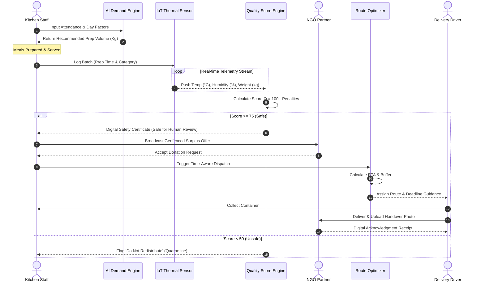

# SMARTFOOD RESCUE AI — WORKING FLOW DIAGRAMS & SCHEMATICS

> **Document Purpose:** Official visual and structural working flow diagrams for presentations, technical documentation, and seminar slides.

---

## 1. 5-Stage Operational Pipeline Flowchart (Mermaid)

```mermaid
flowchart TD
    %% Styling
    classDef inputPhase fill:#1e293b,stroke:#3b82f6,stroke-width:2px,color:#fff
    classDef aiPhase fill:#1e1b4b,stroke:#8b5cf6,stroke-width:2px,color:#fff
    classDef kitchenPhase fill:#064e3b,stroke:#10b981,stroke-width:2px,color:#fff
    classDef iotPhase fill:#451a03,stroke:#f59e0b,stroke-width:2px,color:#fff
    classDef safetyGate fill:#312e81,stroke:#6366f1,stroke-width:2px,color:#fff
    classDef ngoPhase fill:#134e4a,stroke:#14b8a6,stroke-width:2px,color:#fff
    classDef routePhase fill:#701a75,stroke:#d946ef,stroke-width:2px,color:#fff
    classDef auditPhase fill:#14532d,stroke:#22c55e,stroke-width:2px,color:#fff

    subgraph STAGE1 ["STAGE 1: PRE-COOKING DEMAND FORECASTING"]
        A1["Input Attendance & Factors<br/>(Student Headcount, Event, Holiday, Menu)"]:::inputPhase
        A2["Weighted Attendance Regression Engine<br/>Base Demand x Attendance Factor x Event Multiplier"]:::aiPhase
        A3["Output Prep Recommendation<br/>(Recommended Meals & Overproduction Risk)"]:::aiPhase
        A1 --> A2 --> A3
    end

    subgraph STAGE2 ["STAGE 2: BATCH LOGGING & IOT TELEMETRY"]
        B1["Kitchen Staff Log Cooked Batch<br/>(Food Category, Prep Time, Initial Kg)"]:::kitchenPhase
        B2["Virtual / Physical IoT Sensors<br/>(Core Temp °C, Humidity %, Container Weight kg)"]:::iotPhase
        B3["Continuous Thermal Stream<br/>(Safe Threshold: < 8°C or > 60°C)"]:::iotPhase
        A3 --> B1 --> B2 --> B3
    end

    subgraph STAGE3 ["STAGE 3: AUTOMATED QUALITY SCORING GATE"]
        C1["Quality Scoring Engine (0-100)<br/>Q = 100 - (Time + Temp + Storage + Package Penalties)"]:::safetyGate
        C2{"Is Quality Score >= 75<br/>AND Time < 4 Hours?"}:::safetyGate
        C3["CERTIFIED: Safe for Human Review<br/>Digital Safety Pass Issued"]:::kitchenPhase
        C4["DISCARD / QUARANTINE<br/>Do Not Redistribute Flag"]:::inputPhase
        B3 --> C1 --> C2
        C2 -- YES --> C3
        C2 -- NO --> C4
    end

    subgraph STAGE4 ["STAGE 4: GEOFENCED NGO CAPACITY MATCHING"]
        D1["Geofenced Match Engine<br/>Filter Radius (< 12 km) & Available Capacity"]:::ngoPhase
        D2["Ranked Recipient Match List<br/>Sort by Distance, Capacity & Refrigeration"]:::ngoPhase
        D3["Surplus Broadcast & NGO Acceptance<br/>One-Tap Accept Request"]:::ngoPhase
        C3 --> D1 --> D2 --> D3
    end

    subgraph STAGE5 ["STAGE 5: TIME-AWARE DISPATCH & AUDIT"]
        E1["Route Time & Feasibility Calculator<br/>ETA = (Distance / Speed) x 60 + 10m Buffer"]:::routePhase
        E2{"ETA <= Deadline?"}:::routePhase
        E3["Dispatch Logistics Driver<br/>Live Map Tracking (Steps 1-6)"]:::routePhase
        E4["Photo-Verified Delivery Receipt<br/>Immutable ESG & Carbon Audit Update"]:::auditPhase
        E5["FLAG AT RISK / RE-ROUTE<br/>Select Faster Vehicle / Closer NGO"]:::inputPhase
        D3 --> E1 --> E2
        E2 -- YES --> E3 --> E4
        E2 -- NO --> E5
    end
```



---

## 2. System Interaction Sequence Diagram (Mermaid)



---

## 3. Role Swimlane Diagram

```mermaid
flowchart LR
    subgraph KitchenStaff ["KITCHEN STAFF"]
        K1[1. Input Student Headcount] --> K2[2. Receive AI Prep Target]
        K2 --> K3[3. Cook & Log Food Batch]
        K3 --> K4[4. Monitor IoT Thermal Alert]
    end

    subgraph QualityEngine ["QUALITY ENGINE"]
        Q1[5. Continuous Temp Evaluation] --> Q2{6. Score >= 75?}
        Q2 -- Yes --> Q3[7. Issue Safety Certificate]
        Q2 -- No --> Q4[Reject / Quarantine]
    end

    subgraph NGOPartner ["NGO PARTNER"]
        N1[8. Receive Proximity Alert] --> N2[9. Review Batch & Expiry]
        N2 --> N3[10. Accept Donation]
    end

    subgraph DeliveryDriver ["DELIVERY DRIVER"]
        D1[11. Receive Assigned Route] --> D2[12. Pickup Insulated Box]
        D2 --> D3[13. In-Transit GPS Navigation]
        D3 --> D4[14. Upload Delivery Photo]
    end

    K4 --> Q1
    Q3 --> N1
    N3 --> D1
```



---

## 4. Text-Based Visual Diagram (Ideal for PPT / Slides)

```
+-----------------------------------------------------------------------------------+
|                        SMARTFOOD RESCUE AI — WORKING FLOW                         |
+-----------------------------------------------------------------------------------+
|                                                                                   |
|  [ 1. INPUT FACTORS ]  ---> [ 2. AI FORECASTING ] ---> [ 3. KITCHEN PREPARATION ] |
|  - Student Attendance        - Regression Model        - Meals Prepared vs Served |
|  - Day / Event Type          - Recommended Prep Target - Batch ID & Deadline      |
|                                                                 |                 |
|                                                                 v                 |
|  [ 6. TIME DISPATCH ]  <--- [ 5. NGO MATCHING ]   <--- [ 4. IOT QUALITY CHECK ]  |
|  - Speed & Travel ETA        - Geofence Proximity      - Temp: 68°C Hot Holding   |
|  - 10-Min Handling Buffer    - Capacity Match (Kg)     - Safety Score: 92/100     |
|             |                                                                     |
|             v                                                                     |
|  [ 7. VERIFIED HANDOVER ] -> [ 8. ESG CARBON AUDIT ]                              |
|  - Photo Proof Receipt        - 2.5 kg CO2e / kg Saved                            |
|  - Chain of Custody           - FSSAI Compliance Report                           |
|                                                                                   |
+-----------------------------------------------------------------------------------+
```
